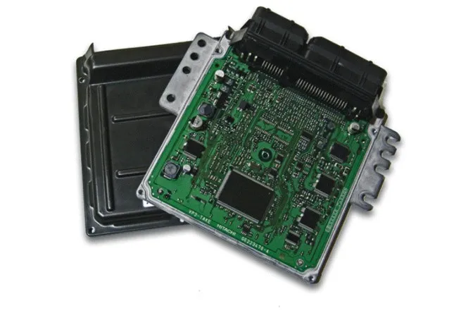
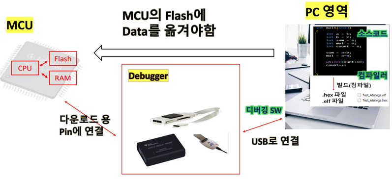

### MCU 개요
* 오늘날의 자동차 부품 대부분은 전자화 되어있으며 SW에 의해 조작 → SW를 실행하는 컴퓨터가 필요  
* 자동차 업계에서 해당 컴퓨터 역할을 하는 하드웨어를 **제어기** 또는 **ECU**라고 함  
* 제어기는 각 차량 부품마다 따로 존재하며 케이스에 패키징되어 자동차에 내장되어있음
* 제어기(ECU) 안에 실제 SW가 실행, 동작되는 **작은 크기의 컴퓨터**를 **MCU(Micro Controller Unit)** 라고함   
* MCU는 CPU, 플래시, 램을 비롯한 다양한 하드웨어 장치로 구성  
* 제어기는 MCU와 제어기가 동작하기 위해서 필요한 부수적인 부품이 보드에 구성되어 자동차에 **내장(Embedded)** 되어있음  
 

    

<strong>ECU</strong>

### MCU SW 특징  
1. 각 제품을 제어하기 위한 동작만을 반복해서 수행하고 있음 (cf. 가정용 PC)  
→ PC보다 일반적으로 낮은 성능의 CPU, 작은 크기의 메모리 탑재
2. 제한된 성능 조건에서 필요한 기능 모두 수행되도록 SW 구현 필요
3. SW 개발환경(PC)과, 실제 실행되는 환경(MCU)이 다름     
→ PC에서 개발된 SW를 MCU로 옮기는 과정필요  
→ 디버깅이 어려워 별도 디버깅을 위한 장비(디버거) 필요  
4. 임베디드 MCU SW의 일반적 구조 :  
→ Input (센서, 버튼, 통신) → Processing (SW 로직) → Output (모터, LCD화면, 메시지 송신)

### MCU 개발 과정
* MCU를 구성하는 CPU는 사람이 작성한 소스 코드(C, C++, Python 등)를 직접 이해하고 명령을 수행할 수 없음
* 사람이 작성한 **소스 코드(.c)** 를 CPU가 이해할 수 있는 **어셈블리어, 기계어(.hex,.elf)** 로 변환하는 과정이 필요함  
→ 이 과정을 **빌드(컴파일)** 라고하며 이를 **컴파일러** 가 수행함. 즉 컴파일러는 빌드를 수행하는 SW  
→ 따라서 MCU의 CPU는 소스 코드를 그대로 실행을 하는것이 아닌 변환된 기계어가 담겨진 .hex, .elf 파일의 명령어를 한줄 한줄 해석하고 수행함  
**※** 빌드 과정은 엄밀히 Compile(r), Assemble(r), Link(er)로 구성되지만 모든 과정을 통칭하여 컴파일로 부름  
* ATmega128, STM32 등 다양한 MCU가 존재하며, MCU에 따라 이해할 수 있는 기계어 명령어의 형태가 다름  
→  각 MCU를 지원하는 컴파일러 또한 여러 종류가 존재하며, 사용하는 MCU를 지원하는 컴파일러를 선택하여 사용해야함
* 소스 코드와 컴파일을 통해 말들어진 .hex, .elf 파일은 모두 개발자의 PC의 하드디스크 또는 SSD 저장장치에 파일 형태로 남아있음  
→  컴파일된 .hex,.elf 파일을 MCU의 **플래시 메모리** 에 옮기기 위한 과정이 필요하며 이를 위한 하드웨어 장비를 **디버거** 라고 부름   
→  디버거의 종류에는 **Trace32(T32), TI의 XDS110, ST의 ST-Link** 등이 있으며 MCU의 특정핀과 연결되어 **디버깅**을 위한 여러가지 기능 및 SW 다운로드 기능 제공하고 이를 제어하기 위한 **디버깅SW** 필요  
→  개발하려는 **MCU와 호환되는 컴파일러 SW, 디버거 HW, 디버깅 SW 선택 필요**  
**※** MCU는 명령을 수행하는 CPU(Central Processing Unit)뿐 아니라 데이터를 담아두는 플래시 메모리와 RAM으로 구성되며 CPU는 이들 메모리에 있는 데이터를 읽고 쓸 수 있음. 이때 플래시 메모리는 전원을 껐다 켜도 데이터가 유지되지만, RAM은 전원을 끄면 저장된 내용이 모두 사라지는 일시적 메모리
 

    

<strong>MCU 개발 과정</strong>

### IDE 개요
* 코딩 → 빌드 → 다운로드/디버깅 전체 MCU 개발 과정을 하나의 프로그램에서 수행할 수 있도록 구성된 개발 환경을 **IDE (Integrated Development Environment-통합 개발 환경)** 라고 함
* IDE에는 코드 에디터, 컴파일러, 디버깅 SW가 모두 포함되며 보통 MCU 제조사에서 무료로 제공 (디버거는 별도 구매 필요, 주로 MCU 제조사에서 사용할 수 있는 디버거를 함께 판매)  
* 대표적인 MCU 제조사-IDE 이름-(대표 MCU 예시) : **Microchip-Microchip Studio-(ATmega128), ST-STM32 Cube IDE-(STM32\|4s5vit6), TI-Code Composer Studio(CCS)-(TMS320F280039C), Infineon-Aurix Development Studio, NXP-MUCXpresso**   

* IDE 실습 Tip
    * IDE에서 신규 프로젝트 생성 시 개발 Target MCU 지정 가능  
    * 생성된 프로젝트에는 선택된 MCU에 맞게 여러가지 컴파일러 셋팅이 자동으로 적용되어있음   
    → Default Setting을 써도 되지만 **Complier, Assembler, Linker**에 대한 Configuration 변경 가능  
    * 프로젝트 빌드시 사용자가 구현한 main 코드 외에 **Startup Code** 도 함께 앞부분에 빌드됨  
    → MCU는 전원이 인가되면 바로 main 함수가 실행되는 것이 아닌, 전역변수 초기화 등 기본 환경을 설정하는 Startup Code가 먼저 실행되며, IDE 설치 폴더에 Startup Code(.o, .s)가 제공됨   
    → 필요에 따라 개발자가 Startup Code 수정 가능
    * 빌드 완료 후 일반적으로 **Debug 폴더** 에 **.hex, .elf** 파일이 생성됨  
    * MCU 플래시 메모리로 .hex, .elf 파일을 다운받기 위해서 IDE에서 어떤 **디버거** 및 **(통신)인터페이스** 를 사용할지 설정 필요  
    → 디버거가 연결된 상태에서는 CPU가 코드를 자동 실행하지 않고 정지 상태로 유지되며 이때 디버깅 및 검증 작업을 수행할 수 있음. 사용자가 디버거를 통해 Run 명령을 내리거나 디버거 연결을 해제하고 MCU를 재부팅하면 프로그램이 정상적으로 자동 실행
    * **디버깅**시 **Start/일지 정지/Stop**, **변수값 확인**(디버거에 따라 실시간 로깅 가능), **변수값 변경**, **Break Point** 등의 작업 가능

### 메모리 개념
* **메모리** : 데이터를 저장할 수 있는 기억장치로 크게 2가지로 분류
1. **ROM**  
    * 하드디스크, SSD, **Flash** 등 해당
    * 전원 Off해도 데이터가 지워지지 않음
    * 값을 읽고 쓰는 절차가 RAM에 비해 복잡하고 느림  
    → 중간에 Flash Controller가 있어 레지스터에 적절한 값을 적절한 순서로 써야 Flash에 값을 쓰고 읽기 가능  
2. **RAM**  
    * SRAM, DRAM, 등 해당
    * 전원 Off하면 데이터 초기화
    * 값을 읽고 쓰는 절차가 ROM에 비해 빠름  
    → 기계어 명령어 한줄로 가능 (예: RAM에 값 5를 써라, RAM에서 값을 읽어와라)  

* **메모리 용량**  
→ 얼마나 많은 데이터를 저장할 수 있는지 나타내는 지표 (단위 : Byte)  
→ 1024Byte = 1KB, 1024KB = 1MB, 1024MB = 1GB, 1024GB = 1TB  

* **메모리 주소**   
→ MCU 동작시 어떤 **메모리 주소(위치)**에 접근하여 데이터를 읽고 쓸지 정의 필요  
→ 메모리는 바이트 단위로 **고유한** 주소가 할당되며, 이 주소 정보는 MCU 제조사가 정의하여 Data Sheet(**Memory Map**) 에 명시  
→ 정의되지 않은(할당되지 않은) 영역은 **Reserved Memory**로 분류되며, CPU가 이 영역에 접근하면 에러 또는 비정상 동작이 발생할 수 있음. (예: 포인터로 잘못된 주소 접근, 컴파일러 설정 오류 등)  
→ 하나의 MCU에는 Flash, RAM, Peripheral Register 등 여러 종류의 메모리가 존재하며, 각 종류별로 고유 주소 범위가 부여되며 대부분의 MCU는 메모리 주소를 16진수(0x~) 형태로 표현