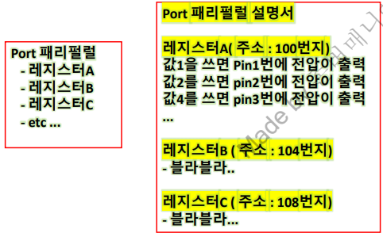
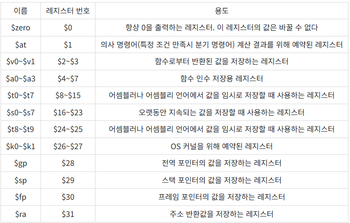

### MCU 개념
* 오늘날의 자동차 부품 대부분은 전자화 되어있으며 SW에 의해 조작 → SW를 실행하는 컴퓨터가 필요  
* 자동차 업계에서 해당 컴퓨터 역할을 하는 하드웨어를 **제어기** 또는 **ECU**라고 함  
* 제어기는 각 차량 부품마다 따로 존재하며 케이스에 패키징되어 자동차에 내장되어있음
* 제어기(ECU) 안에 실제 SW가 실행, 동작되는 **작은 크기의 컴퓨터**를 **MCU(Micro Controller Unit)** 라고함   
* MCU는 CPU, 플래시, 램을 비롯한 다양한 하드웨어 장치로 구성  
* 제어기는 MCU와 제어기가 동작하기 위해서 필요한 부수적인 부품이 보드에 구성되어 자동차에 **내장(Embedded)** 되어있음  
 

    

<strong>ECU</strong>

### MCU SW 특징  
1. 각 제품을 제어하기 위한 동작만을 반복해서 수행하고 있음 (cf. 가정용 PC)  
→ PC보다 일반적으로 낮은 성능의 CPU, 작은 크기의 메모리 탑재
2. 제한된 성능 조건에서 필요한 기능 모두 수행되도록 SW 구현 필요
3. SW 개발환경(PC)과, 실제 실행되는 환경(MCU)이 다름     
→ PC에서 개발된 SW를 MCU로 옮기는 과정 필요  
→ 디버깅이 어려워 별도 디버깅을 위한 장비(디버거) 필요  
4. 임베디드 MCU SW의 일반적 구조 :  
→ Input (센서, 버튼, 통신) → Processing (SW 로직) → Output (모터, LCD화면, 메시지 송신)

### MCU SW 개발 과정
* MCU를 구성하는 CPU는 사람이 작성한 소스 코드(C, C++, Python 등)를 직접 이해하고 명령을 수행할 수 없음
* 사람이 작성한 **소스 코드(.c)** 를 CPU가 이해할 수 있는 **어셈블리어, 기계어(.hex,.elf)** 로 변환하는 과정이 필요함  
→ 이 과정을 **빌드(컴파일)** 라고하며 이를 **컴파일러** 가 수행  
→ 따라서 MCU의 CPU는 소스 코드를 그대로 실행을 하는것이 아닌 변환된 기계어가 담겨진 .hex, .elf 파일의 명령어를 한줄 한줄 해석하고 수행함  
**※** 빌드 과정은 엄밀히 Compile, Assemble, Link로 구성되지만 모든 과정을 통칭하여 컴파일로 부름  
* ATmega128, STM32 등 다양한 MCU가 존재하며, MCU에 따라 이해할 수 있는 기계어 명령어의 형태가 다름  
→  각 MCU를 지원하는 컴파일러 또한 여러 종류가 존재하며, 사용하는 MCU를 지원하는 컴파일러를 선택하여 사용해야함
* 소스 코드와 컴파일을 통해 말들어진 .hex, .elf 파일은 모두 개발자의 PC의 하드디스크 또는 SSD 저장장치에 파일 형태로 남아있음  
→  컴파일된 .hex,.elf 파일을 MCU의 **플래시 메모리** 에 옮기기 위한 과정이 필요하며 이를 위한 하드웨어 장비를 **디버거** 라고 부름   
→  디버거의 종류에는 **Trace32(T32), TI의 XDS110, ST의 ST-Link** 등이 있으며 MCU의 특정핀과 연결되어 **디버깅**을 위한 여러가지 기능 및 SW 다운로드 기능 제공하고 이를 제어하기 위한 **디버깅SW** 필요  
→  개발하려는 **MCU와 호환되는 컴파일러 SW, 디버거 HW, 디버깅 SW 선택 필요**  
 

    

<strong>MCU 개발 과정</strong>

### IDE 개념
* 코딩 → 빌드 → 다운로드/디버깅 전체 MCU 개발 과정을 하나의 프로그램에서 수행할 수 있도록 구성된 개발 환경을 **IDE (Integrated Development Environment-통합 개발 환경)** 라고 함
* IDE에는 코드 에디터, 컴파일러, 디버깅 SW가 모두 포함되며 보통 MCU 제조사에서 무료로 제공 (디버거는 별도 구매 필요, 주로 MCU 제조사에서 사용할 수 있는 디버거를 함께 판매)  
* 대표적인 MCU 제조사-IDE 이름-(대표 MCU 예시) : **Microchip-Microchip Studio-(ATmega128), ST-STM32 Cube IDE-(STM32\|4s5vit6), TI-Code Composer Studio(CCS)-(TMS320F280039C), Infineon-Aurix Development Studio, NXP-MUCXpresso**   

* IDE 실습 Tip
    * IDE에서 신규 프로젝트 생성 시 개발 Target MCU 지정 가능  
    * 생성된 프로젝트에는 선택된 MCU에 맞게 여러가지 컴파일러 셋팅이 자동으로 적용되어있음   
    → Default Setting을 써도 되지만 **Complier, Assembler, Linker**에 대한 Configuration 변경 가능  
    * 프로젝트 빌드시 사용자가 구현한 main 코드 외에 **Startup Code** 도 함께 앞부분에 빌드됨  
    → MCU는 전원이 인가되면 바로 main 함수가 실행되는 것이 아닌, 전역변수 초기화 등 기본 환경을 설정하는 Startup Code가 먼저 실행되며, IDE 설치 폴더에 Startup Code(.o, .s)가 제공됨   
    → 필요에 따라 개발자가 Startup Code 수정 가능
    * 빌드 완료 후 일반적으로 **Debug 폴더** 에 **.hex, .elf** 파일이 생성됨  
    * MCU 플래시 메모리로 .hex, .elf 파일을 다운받기 위해서 IDE에서 어떤 **디버거** 및 **(통신)인터페이스** 를 사용할지 설정 필요  
    → 디버거가 연결된 상태에서는 CPU가 코드를 자동 실행하지 않고 정지 상태로 유지되며 이때 디버깅 및 검증 작업을 수행할 수 있음. 사용자가 디버거를 통해 Run 명령을 내리거나 디버거 연결을 해제하고 MCU를 재부팅하면 프로그램이 정상적으로 자동 실행
    * **디버깅**시 **Start/일지 정지/Stop**, **변수값 확인**(디버거에 따라 실시간 로깅 가능), **변수값 변경**, **Break Point** 등의 작업 가능

### 메모리(Memory) 개념
* **메모리** : 데이터를 저장할 수 있는 기억장치로 크게 2가지로 분류

1.  **ROM**  
* 하드디스크, SSD, **Flash** 등 해당  
* 전원 Off해도 데이터가 지워지지 않고 남아있음  
* 값을 읽고 쓰는 절차가 RAM에 비해 복잡하고 느림  
→ 중간에 Flash Controller가 있어 레지스터에 적절한 값을 적절한 순서로 써야 Flash에 값을 쓰고 읽기 가능  

2.  **RAM**  
* SRAM, DRAM, 등 해당  
* 전원 Off하면 데이터 초기화  
* 값을 읽고 쓰는 절차가 ROM에 비해 빠름  
→ 기계어 명령어 한줄로 가능 (예: RAM에 값 5를 써라, RAM에서 값을 읽어와라)  

* **메모리 용량**  
→ 얼마나 많은 데이터를 저장할 수 있는지 나타내는 지표 (단위 : Byte)  
→ 1024Byte = 1KB, 1024KB = 1MB, 1024MB = 1GB, 1024GB = 1TB  

* **메모리 주소**   
→ MCU 동작시 어떤 **메모리 주소(위치)**에 접근하여 데이터를 읽고 쓸지 정의 필요  
→ 메모리는 **바이트 단위**로 **고유한** 주소가 할당되며, 이 주소 정보는 MCU 제조사가 정의하여 Data Sheet(**Memory Map**) 에 명시  
→ 정의되지 않은(할당되지 않은) 영역은 **Reserved Memory**로 분류되며, CPU가 이 영역에 접근하면 에러 또는 비정상 동작이 발생할 수 있음. (예: 포인터로 잘못된 주소 접근, 컴파일러 설정 오류 등)  
→ 하나의 MCU에는 Flash, RAM, Peripheral Register 등 여러 종류의 메모리가 존재하며, 각 종류별로 고유 주소 범위가 부여. 대부분의 MCU는 메모리 주소를 16진수(0x~) 형태로 표현

### 패리펄럴(Peripheral) 개념
* MCU는 내부에 다양한 기능을 내장하고 있으며, MCU 개발자는 이러한 기능을 적절히 활용해 여러 전자장치를 원하는 동작으로 제어하도록 설계하게 됨  
* **이 기능들을 실제로 제공하는 주변장치(하드웨어)를**를 통칭하여 패리펄럴이라고하며 **MCU 내부에** 다양한 패리펄럴이 존재   
→ **GPIO(General Purpose Input Output)** : 특정 pin에 **전압 출력 On/Off 제어** (패리펄럴 이름 : Port)  
→ **ADC** : 특정 pin에 걸려있는 **전압을 측정** (패리펄럴 이름 : ADC)  
→ 각종 통신 : Uart, SPI, CAN, I2C 등 다양한 통신 (페리펄럴 이름 : SPI, Uart, MultiCAN, MCMCAN...)  
→ PWM (패리펄럴 이름 : PWM, GTM, TIM1...)  
→ 그외 Watchdog, DMA, Timer, Interrupt, DAC...
* MCU마다 내장된 패리펄럴의 이름, 기능 구성, 종류 및 개수가 모두 다르므로 개발자는 수행하려는 과제의 요구사항에 맞게 적절한 MCU를 선정해야 함  
→ MCU 관련 기술 정보는 제조사가 문서의 성격에 따라 분류하여 제공하며, 해당 문서의 형식과 명칭(DataSheet, User Manual, Reference Manual 등)은 제조사마다 상이함  

### 패리펄럴 레지스터(Peripheral Register) 개념
* **패리펄럴 내부**에는 여러 개의 레지스터(**작은 크기의 메모리**)가 존재 
* 패리펄럴의 레지스터는 Flash, RAM과 동일하게 고유한 메모리 주소를 가지며, **개발자는 C 언어의 포인터를 통해 CPU가 해당 레지스터 주소에 접근하여 값을 읽고 쓰는 형태로 MCU SW를 구현**하여 패리펄럴을 적절하게 제어  
→ MCU SW(CPU) 동작 : 메모리에서 값을 읽어온다 → 읽어온 값으로 사칙연산, 조건문 판단, 반복문 수행 → 메모리에 값을 쓴다  
→ cf. CPU 내부에도 별도의 레지스터가 존재하며, 메모리 주소를 사용하지 않고 CPU가 직접 접근할 수 있음
* 레지스터는 패리펄럴을 제어하는 ‘리모컨’이자 동작 상태를 확인하는 ‘계기판’ 역할, 즉 레지스터 값에 따라 패리펄럴이 동작하며 패리펄럴의 상태를 레지스터를 통해 확인할 수 있음  
 

    

<strong>패리펄럴-레지스터 구조</strong>

* MCU 제조사는 MCU에 포함된 페리펄럴의 종류, 동작 방식, 레지스터에 따른 패리펄럴 동작 등을 설명한 기술 문서 제공  
* 레지스터 내부는 여러개의 **비트 필드**로 구성되며 각 피트 필드 마다 서로 다른 역할을 갖고 있음
* 매뉴얼문서 읽기 Tip → **메뉴얼문서를 꼼꼼히 읽는 것이 중요!**
    * Set : 값이 1이 되는것, Clear/Reset : 값이 0이 되는것  
    * R/W : Read & Write이 모두 가능, R : 읽기 전용, W : 쓰기 전용
    * Write Protection 속성 : 값을 변경하기 위해 다른 비트 필드 값이 특정 조건 만족 필요
    * 특이한 비트필드  
        Writing 0 has no effect → 다른 레지스터에 0을 써야 해당 비트 0 으로 수정  
        It is cleared by software by writing '1'
* MCU SW 개발 과정
    1. 구현하려는 기능 정의 (LED를 주기적으로 깜박거리는 기능)
    2. 기능 구현을 위한 패리펄럴 파악 (MCU의 Port 패리펄럴의 GPIO Output 기능 활용)
    3. 해당 기능의 사용 방법 파악 (MCU 데이터시트, 유저메뉴얼 보고 상세한 사용방법, 동작 파악)
    4. 데이터시트 내용을 바탕으로 IDE로 코드 구현, 빌드한 후 디버거로 프로그램을 MCU에 다운로드한 후, 디버깅을 통해 정상 동작 유무(MCU의 레스트터값) 확인    
* **Driver SW (HAL SW)** 
    * **API 형태로 특정 패리펄럴 레지스터에 값을 읽고 쓰도록하는 소프트웨어를 미리 구현**하여 사용자 구현된 API를 호출하여 사용하여 가독성, 재사용성 향상  
    → IDE에서 매크로 및 심볼이 정의된 헤더 파일(.h)을 include하여 사용자가 일일이 레지스터 주소를 통해 데이터를 읽고 쓰는 구현하지 않고 해더 파일을 통해 빌드 과정에서 대응되는 실제 메모리 주소로 치환  
    → ex. Set_GPpio_Mode(int PinName, int PinNumber, int mode), Set_GPpioOutput(int PinName, int PinNumber, int level)
    * MCU 회사에서 Drvier SW 및 매뉴얼을 제공
    → STM32(STM HAL Driver SW), TI(C2000ware), Infineon Aurix(iLLD SW), 아두이노(제공)
    * 디버깅과 문제 해결 능력, Driver SW에서 제공하지 않는 MCU 기능 활용, 그리고 SW 최적화 측면까지 고려하려면 Driver SW뿐 아니라 MCU 내부 동작 방식 또한 함께 이해하는 것이 중요

### 보드(PCB) 개념
* MCU와 필요한 하드웨어 부품을 얇은 기판 위에 납땜으로 고정하고, 기판 위에 형성된 구리 배선을 통해 MCU 핀과 각 부품이 전선처럼 연결되도록 구성한 것   
* **PCB(Printed Circuit Board)** : 회로가 기판 위에 인쇄된 형태로 구현된 보드  
* **회로도(Schematic)** : 사용된 소자와 소자 간 연결 관계를 표현한 문서로, MCU 개발자는 개발 전 회로도를 통해 HW 구성 파악 필요
* **아트워크(Artwork)** : 회로도를 기반으로 보드의 물리적 형상(크기, 레이어, 소자 배치, 배선 등)을 설계하는 단계  
* 전체 제작 흐름 : 소자 선정 및 회로 설계 → 회로도 작성 → 아트워크 → 거버 파일 생성 → PCB 제작 → Bare Board → 부품 실장(납땜) → 최종 PCB 완성
* 제작된 보드는 항상 완벽하지 않을 수 있으므로, HW 문제 가능성을 염두에 두고 개발해야 함

### 멀티미터
* (보드에 문제가 의심될 경우) 전압, 도통 상태, 저항 등을 측정하기 위한 계측 장비  
* **전압 측정**: 두 리드봉(테스트 리드) 사이의 전압 차이를 측정, 일반적으로 검은색 리드봉을 GND(0V)에 연결하고 빨간색 리드봉으로 측정 지점을 확인하며, 이때 거버파일을 활용하여 실제 보드상 측정 위치 파악 가능  
* **도통 테스트**: 회로가 전기적으로 연결되어 있는지(두 지점 사이에 저항이나 다른 부품 없이 **오직 전선으로** 연결된 상태인지) 확인하는 테스트이며, 멀티미터 자체의 동작 여부를 점검할 때도 사용함. 도통 시 멀티미터에서 삐 소리가 나며, 도통 테스트는 반드시 측정 대상 회로의 전원을 차단한 상태에서 수행해야 함

### 부록
* **어셈블리어 / 기계어 개념**
    * CPU가 실제로 이해하고 실행가능한 명령어를 의미
    * MCU(CPU) 종류에 따라 다양한 어셈블리어(기계어) 존재 (ex. **MIPS**)  
    * C언어 → 빌드 → 어셈블리어(기계어) → Fetch(명령어를 CPU가 한 줄씩 읽는 과정) → CPU 실행 순서로 동작
    * **레지스터**란 **CPU 내부에 존재하는 작은 크기의 메모리**로, 패리퍼럴 레지스터과는 성격이 다름
    → CPU가 직접 접근하며 가장 빠르게 읽고 쓸 수 있는 저장장치로, 외부 메모리인 RAM 및 Flash 처럼 메모리 주소를 가지지 않고 **각 레지스터마다 고유 번호**를 가짐
    * CPU마다 레지스터의 수와 크기가 다르며 보통 8bit / 16bit / 32bit 형태로 구성됨.  
    →  ex. MIPS는 32bit 레지스터 32개 보유
    * 어셈블리어는 C언어를 특정 규칙에 따라(ex. MIPS 아키텍처) 컴퓨터가 읽을수 있는 언어로 사람이 읽기 쉽게 변환한 형태일 뿐, 실제 MCU의 Flash의 레지스터에는 이를 숫자로 변환한 기계어만 저장됨. 결국 어셈블리어와 기계어는 동일한 동작을 표현하는 서로 다른 표현 방식
    * **MIPS 아키텍처 ($표시 있으면 레지스터를 의미)**

    

<strong>MIPS 레지스터 32가지 (모두 32bit)</strong>

  
|C언어|어셈블리어|기계어|
|:---:|:---:|:---:|
|int a = 3|addi $t0 $0 3|20 08 00 03|
|int b = 4|addi $t1 $0 4|20 09 00 04|
|int c = 0|add  $t2 $t0 $t0|00 00 50 20|
|c = a + b|add  $t2 $t0 $t1|01 09 50 20|
  
<b>C언어 · 어셈블리어 · 기계어(16진수) 비교 예시 (MIPS)</b>
  
|어셈블리어|의미|
|:---:|:---:|
|addi $a $b 숫자|$a = $b + 숫자|
|add  $a $b $c|$a = $b + $c|
  
<b>기계어 명령어 (MIPS)</b>

* **HEX / ELF 파일 개념** 
    * C코드를 빌드하면 .hex, .elf 파일이 생성되며, MCU에서 실제 실행될 **기계어 코드**가 포함됨
    * 생성된 기계어를 어떤 Flash 메모리 주소에 다운로드할지 결정 필요  
    → **hex 파일에 기계어와 해당 기계어를 다운로드할 메모리 주소 정보가 함께 포함** 
    * 메모리 주소 할당은 컴파일러가 빌드 과정(Compile → Assemble → Link) 중 링크(Link)단계에서 수행하며 이때 **링커 스크립트(Linker Script)** 를 참조하여 MCU의 메모리 맵을 기준으로 결정  
    * 링커 스크립트 파일은 컴파일러마다 명칭과 확장자가 다름  
    → Linker Script File, Scatter Loading File, Linker Command File (확장자: .lsl, .ld, .cmd)
    * elf 파일 = hex 파일(기계어 코드 + 주소 정보) + **디버깅을 위한 추가 정보** + 그외 정보
    * hex 파일에는 기계어만 있어, 해당 기계어가 어떤 C 코드 라인에 대응하는지 알 수 없음 
    → 이러한 **C 코드–기계어 매핑 정보**는 elf 파일에 포함됨
    * 디버깅 기능(브레이크포인트, 코드 일시 정지, 변수 값 확인 등)을 사용하려면 hex 파일이 아닌 elf 파일이 필요
    * elf 파일을 MCU Flash에 다운로드할 때 실제 MCU에 다운로드되는것은 기계어 코드만이며, 디버깅 정보는 디버거로 전달  
    → SW를 개발하는 과정중에는 디버깅을 위해서 elf 파일을 다운로드 하는것이 일반적이지만, 개발이 완료된 후 실제 제품에 SW가 다운로드될때는 hex파일만 사용

