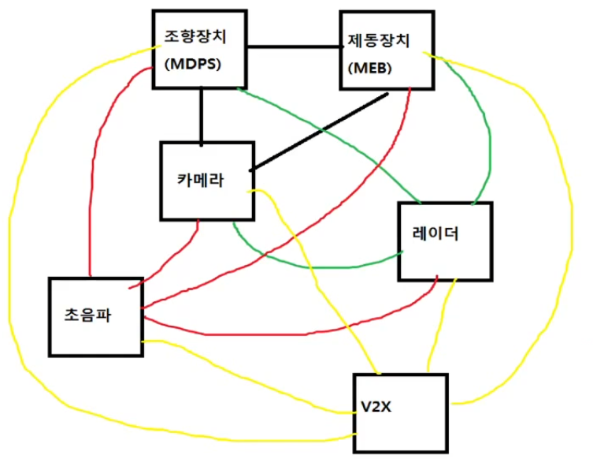

### CAN(Controller Area Network) 통신 등장 배경 및 특징

* 통신이란 서로 다른 두 주체가 정보를 주고받는 것을 의미  
→ 무선통신을 제외하면 전선(통신매체)을 통해 전기적 신호를 주고받아 통신 수행

* **등장 배경**
    1. 제어기가 추가될수록 필요한 전선의 수가 급격히 증가하여 복잡성 증가
    2. 전선은 부피와 무게를 가지므로, 전선이 많아질수록 무게 증가 → 자동차의 연비 저하
    3. 전선이 많아지면 관리와 유지보수가 어려워지며, 특정 전선의 연결을 찾기 어려움
    4. 제어기(MCU)에 연결 가능한 핀 수에 한계가 있어, 개발 확장성에 제한
    5. 제어기가 추가되면 소프트웨어도 수정이 필요하여 개발 과정이 복잡해짐
     
    

        
    

    
<strong>CAN 등장 배경</strong>

    → BOSCH에서 차량 제어기 간 통신 목적에 특화된 프로토콜 개발  
    → 이러한 문제를 해결하기 위해 CAN 통신은 다음과 같은 특징을 가짐
    
* **CAN 통신의 특징**
    * **버스형 토폴로지**
        - 각 제어기를 1대1로 연결하지 않고, **공통선(버스)** 을 사용하여 제어기를 연결
        - 제어기를 추가하거나 제거하는 것이 간단해지고, 전선의 양이 크게 줄어듦
        - 전선의 무게가 감소하여 연비 향상
         
        

            
        

        
<strong>버스형 토폴로지</strong>

    
    * **브로드캐스트 방식**
        - 메시지를 보내면 네트워크에 연결된 **모든 제어기에 전달**
        - 메시지의 목적지를 특정하지 않으므로, 추가된 제어기가 정보를 요청하거나 소프트웨어를 수정할 필요 없이 바로 사용할 수 있음
        - 메시지를 받은 제어기는 필요한 경우 메시지를 사용하고, 그렇지 않을 경우 무시

* **단점 및 해결 방안**
    * 특정 제어기의 고장으로 이상 신호를 보내면 버스를 통해 네트워크 전체에 영향을 미칠 수 있음  
    → CAN 프로토콜은 고장을 감지하면 해당 제어기를 통신에서 제외(Bus Off 상태)하여 다른 제어기 간 통신을 유지

### CAN 커넥터

* CAN 통신은 **두 가닥의 전선, 신호 (CAN HIGH, CAN LOW)** 사용
 

    

<strong>CAN HIGH, LOW</strong>

* 전기 신호를 주고받기 위해 **D-Sub 커넥터**를 사용하여 제어기와 버스 통일 및 연결
    - D 모양의 커넥터로 **9개의 핀**이 있음
    - 핀 번호는 아래와 같이 표준화 되어 있음
        - **CAN LOW**: **2번** 핀
        - **CAN HIGH**: **7번** 핀
    - 제어기와 버스에 같은 D-Sub 커넥터를 사용하고, 핀 번호를 통일하면 손쉽게 연결 가능
     
    

        
    

    
<strong>D-Sub 커넥터</strong>

### 120옴 저항

* CAN 통신에서는 전선을 통해 전기 신호를 전달함. 이때 전기 신호가 버스 양 끝단에서 반사될 수 있으며, 이는 신호 왜곡을 초래하여 통신에 문제를 발생  
→ 이를 방지하기 위해 **버스 양 끝단**에 **120옴 저항**을 연결하여 **반사파에 의한 신호왜곡 방지**
* 자동차 네트워크에는 이미 120옴 저항이 설치되어 있지만, 제어기 개발 과정에서는 테스트 환경이 독립적으로 구성(네트워크 전체를 구성하지 않음)  
→ 개발 중인 제어기와 시뮬레이션 장비 간의 통신을 위해 **120옴 저항**을 직접 연결 필요
* D-Sub 커넥터에 연결된 "CAN 120옴 저항"이라고 표기된 제품이 일반적으로 사용됨
* 통신 문제가 발생할 때는, 사용 중인 커넥터에 **120옴 저항 여부를 확인** 필요

### CAN High & Low Signal

* CAN 통신은 **CAN HIGH**와 **CAN LOW** **두 전선의 전압 차이**를 이용해 데이터(**0, 1**)를 표현
* **전압 차이에 따른 데이터 해석**
    - CAN HIGH - CAN LOW 값이 **0.9~5V** 사이 → 데이터 **0** (Dominant)
    - CAN HIGH - CAN LOW 값이 **0.1~0.5V** 사이 → 데이터 **1** (Recessive)
* 데이터 **0 (Dominant)** 는 데이터 **1 (Recessive)** 보다 **우선순위가 높음**
    - 여러 제어기에서 동시에 0과 1을 출력한다면, 버스에는 0 (Dominant)이 출력
    - 1번 제어기 : 데이터 0 출력, 2~4번 제어기 : 데이터 1 출력 → 버스 전체는 데이터 0 출력  
     
    

        
    

    
<strong>0 (Dominant) & 1 (Recessive)</strong>

* CAN 통신은 **전압 차이**를 사용하므로, **동일한 노이즈가 두 전선에 발생해도 신호 왜곡이 적음**  
→ CAN HIGH와 LOW에 각각 +3V의 노이즈 발생해도 전압 차는 동일하므로 데이터 해석에 영향 없음
* **꼬인 전선** 사용 : 전선을 꼬아 배치하면 노이즈가 골고루 분포되어 더욱 안정적인 통신이 가능  
→ 자동차에서 꼬인 두 전선을 보면, CAN 통신 와이어일 가능성이 높음

### CAN Tranceiver(Transmitter+Receiver) & CAN Controller

* **제어기**: 자동차 내부의 각종 전자 장치(조향장치, 브레이크, 에어백, 엔진 등)를 제어하는 하드웨어로 외부 손상 방지를 위해 케이스에 포장되어 자동차 내부에 장착
* **MCU** : 제어기의 핵심 소자로, 작은 컴퓨터 역할을 수행, CPU, 메모리 다양한 주변 HW 장치 (Peripheral)이 포함됨
 

    

<strong>제어기 & MCU</strong>

- **CAN Controller (Data Link Layer)**
    - **MCU** 내부에 존재하는 **CAN 통신과 관련된 Peripheral**
    - **CAN 통신 프로토콜**에 따라 메시지 전송/수신과 같은 작업 수행
    - **동작 원리**
        1. **메시지 전송**
            - MCU의 소프트웨어가 데이터를 CAN 컨트롤러에 전달
            - CAN 컨트롤러는 데이터를 CAN 메시지 형식에 맞게 구성
            - 메시지 전송 전, 버스 상태를 확인(다른 제어기가 사용 중인지 체크)
        2. **메시지 수신**
            - CAN 컨트롤러가 트렌시버로부터 데이터를 수신 및 해석 후 MCU로 전달
            - CAN 프로토콜에 정의된 에러 처리
- **CAN Tranceiver (Physical Layer)**
    - **CAN HIGH**와 **CAN LOW** 전선을 통해 **신호를 물리적으로 처리(전압 출력)** 하는 소자
    - MCU가 직접 CAN 전압 레벨(3.75V, 2.5V, 1.25V)을 출력하거나 읽을 수 없으므로, 이를 담당  
    → MCU Pin Voltage Level은 1:5V, 0:0V or 1:3.3V, 0:0V 와 같은 형식으로만 출력 가능
    - **동작 원리**
        1. **데이터 전송(CAN TX)** : CAN 컨트롤러 → CAN 트랜시버
            - CAN 컨트롤러로부터 **0/1 데이터를 수신**
            - 데이터를 CAN 프로토콜에 정의된 **전압 신호로 변환**하여 CAN HIGH/LOW에 출력.
        2. **데이터 수신(CAN RX) :** CAN 트랜시버 → CAN 컨트롤러 
            - **CAN HIGH/LOW의 전압을 읽고, 이를 0/1로 변환**하여 CAN 컨트롤러에 전달.
    - MCU 내부의 Peripheral이 아닌 별도의 부품으로 존재 (TJA-1043 (NXP Semiconductors) 등)
    - 트랜시버 제어(슬립 모드, 노멀 모드, 리슨 온리 모드)가 필요 → 데이터시트 참조
     
    

        
    

    
<strong>CAN Controller & CAN Tranceiver</strong>

### 통신 속도 Baud Rate

* **Baud Rate**란 **1초 동안 전송할 수 있는 비트 수**를 나타내며, 단위는 **bps (bit per second)**
* CAN 네트워크(버스)에 연결된 모든 제어기는 **동일한 Baud Rate를 사용**해야 에러가 발생 않음
* 자동차 개발 시 Baud Rate는 OEM에서 결정하며, 이 정보는 **CAN DB**에 포함
* CAN 프로토콜은 크게 **Low-Speed CAN, High-Speed CAN, CAN FD** 3가지 종류로 나뉘며, 각 프로토콜 별로 최대속도의 차이가 있음
* 일반적으로 **High-Speed CAN**은 **최대 1Mbps를 지원**하며, 보통 **500kbps**로 설정
 

    

* 통신 속도(Baud Rate)가 빠를수록 전기 신호의 전파 시간 문제로 인해 버스의 최대 길이가 짧아짐
 

    

* 메시지 전송 시, 송신자가 수신자로부터 (1 bit time 이내) 확인 응답(ACK)을 받아야 하므로, 신호의 왕복 시간이 중요 (bit time은 baudrate과 관련 있음)  
→ 통신속도가 너무 빠르면 신호 왕복이 완료되기 전에 송신자가 다음 작업을 시작해 문제 발생

### 샘플링 포인트 Sampling Point & Synchronization

* **샘플링 포인트**는 하나의 비트 값이 **0인지 1인지 판단하는 지점**을 의미 (단위 : **%**)
* 샘플링 포인트는 Baud Rate와 함께 OEM이 정의하며, 이를 소프트웨어 구현 시 반영해야 함
* CAN Simulation 장비 사용 시 Baud Rate과 함께 Sampling Point도 셋팅해서 사용해야 함
* CAN에서 **1bit**를 **Sync, TSEG1, TSEG2** 3개의 구간으로 분류 (**길이를 세는 단위: Time Quanta, TQ**)
* **Time Quanta**는 CAN 컨트롤러의 **클럭 주파수(Hz)에 의해 정의되는 시간 단위**
    - 1비트는 여러 Time Quanta로 구성되며, 이를  통해 Sync, TSEG1, TSEG2의 길이 설정
    - 예: CAN 클럭 주파수가 100Hz라면, 타임컨터는 1/100초(0.01초)
    - Baud Rate이 1bps의 경우, 1bit가 1초 이며, 이때 CAN 컨트롤러의 클럭 주파수가 10Hz의 경우, 1bit가 10 Time Quanta로 이루어짐
     
    

        
    

    1. **Sync Segment (싱크 구간)**: 시작 구간, 항상 고정된 길이(1 Time Quanta)
    2. **TSEG1 (Time Segment 1)**: 샘플링 포인트 이전의 구간
        - TSEG1은 Propagation Time과 Phase Segment 1로 구성
    3. **TSEG2 (Time Segment 2)**: 샘플링 포인트 이후의 구간
        - 샘플링 포인트는 TSEG1과 TSEG2의 비율로 결정
        - 예: 샘플링 포인트가 70%라면 TSEG1:TSEG2 비율은 7:3으로 설정
    * 서로 다른 제어기의 CAN Controller에서 공급되는 클락의 속도가 오차 있을 때 (Sync Segment 일치 여부로 판단), **TSEG1, TSEG2의 bit 길이를 조절**하여 메시지 송,수신 간 CAN Controller의 CAN 클럭 **싱크를 맞춤**  
    → 길이 조절의 최대양(**SJW: Synchronization Jump Width**)은 OEM이 정해 놓는 경우가 많음  

    

    

---

### 메시지 ID

* CAN에서 모든 메시지 전송은 **브로드캐스트(Broadcast)** 방식, 즉, 한 제어기에서 **메시지**를 보내면 그 메시지는 네트워크에 연결된 모든 제어기로 전송됨
* 브로드캐스트 방식에서 메시지를 **보내는 제어기**와 **받는 제어기**의 정보가 포함되지 않기 때문에, 수신 제어기는 메시지를 보낸 제어기를 알 수 없음 → 이를 구분하기 위해 **메시지 ID** 사용
* **메시지 ID**는 각 메시지를 식별할 수 있도록 **고유**하게 부여되는 값으로, CAN 네트워크에서 메시지를 보낼 때 사용됨
 

    

<strong>메세지 ID</strong>

### CAN 데이터베이스 (CAN DB)

* 각 메시지의 ID와 이에 대응하는 메시지 이름, 보내는 제어기, 받는 제어기 정보 등은 **CAN 데이터베이스**(또는 **Communication Matrix**)로 관리
* 하나의 제어기에서 다양한 메시지 ID를 보내기도 하지만, 특정한 ID의 메세지는 **그 네트워크 안에서** **하나**의 제어기만 송신해야 함
* 하나의 자동차 안에는 여러 CAN 네트워크가 존재할 수 있으며, 각 네트워크에는 서로 다른 **CAN 데이터베이스**가 존재할 수 있음 (`0x123` ID가 BMS의 메시지로 정의되지만, 다른 네트워크에서는 같은 ID가 다른 메시지를 나타낼 수도 있음)
* 이는 기술적인 제약이 아니라 **약속**으로 엔진 제어기가 소프트웨어 구현에 따라 `0x123` ID를 사용하여 메시지를 보낼 수도 있지만 충돌을 피하기 위해서는 각 제어기 간의 약속을 잘 지켜야 함
* **CAN 메시지의 ID**는 길이에 따라 두 가지 포맷으로 구분되며 CAN 메세지의 **Arbitration Field**에 해당 정보가 담김 (하나의 네트워크에서 Standard, Extended 두 가지 포맷 혼용 가능)
    - **Standard Format** : 11비트
    - **Extended Format** : 29비트

    

* *BMS 제어기는 `0x123` ID의 메시지를 보내고, 엔진 제어기는 `0x500` ID의 메시지를 보내는 식으로, 각 제어기마다 고유한 ID를 부여하여 다른 제어기들이 이를 식별할 수 있음. 수신 제어기는 컨셉상 명시 (브로드캐스트로 모든 제어기에서 수신)*

### 메시지 우선 순위

* CAN 통신은 브로드캐스트 방식으로, 모든 메시지가 네트워크 전체에 전달됨
* 여러 제어기들이 **동시에** 메시지를 보낼 경우, 신호가 겹쳐 통신에 문제가 생길 수 있으며 이를 해결하기 위해 CAN에서는 **한 번에 하나의 메시지**만 보낼 수 있도록 **메시지 ID(Arbitration** 필드)를 통해 **우선순위를 설정**함  
  → **ID 값이 작을수록 우선순위가 높음 (123>134>154>201), 즉 ID를 16진수로 변환하였을때 1(Regressive)이 먼저 등장**
    - **버스에 통신 되는 메세지가 없을 때** 우선순위가 높은 메시지가 먼저 보내지고, 우선순위가 낮은 메시지는 대기 → **Arbitration** (중재)
    - CAN에서는 0 (Dominant)이 더 우선순위가 높고, 1 (Recessive)은 상대적으로 우선순위가 낮음
     
    

        
    

    - *CAN Controller는 자신이 신호를 보낸 후 Bus에 있는 신호를 읽어 실제로 보낸 신호가 인가 되었는지 확인. 이때 1(Recessive)을 보냈는데 Bus에 0(Dominent) 이 있다는 것을 인지하면 송신 대기, (0의 우선순위가 더 높음). 단, **이미 버스에 특정 메세지가 통신되고 있는 경우**에는 우선 순위가 높다고 대신 송신되지 않음*
        

### 버스 로드 (Bus Load)

* 전체 네트워크에서 **메시지가 실제로 전달되는 시간의 비율**을 나타내며, **퍼센트(%)** 로 표현 (**CANoe**로 측정 가능)
* 높은 버스 로드는 네트워크에서 더 많은 메시지가 보내지고 있다는 뜻이며, 이 경우 다른 제어기가 메시지를 보내지 못하거나 지연되는 현상이 발생할 수 있음
* 버스 로드를 효율적으로 관리하려면 **메시지 크기(작게)** 나 **전송 주기(낮춰)** 를 조절해야 함 
(OEM에서 정해줌)

### 시그널

* **메시지**: CAN 통신에서는 **데이터를 주고 받는 단위**로 고유한 아이디(ID)가 있음
* **시그널**: **메시지 안에 포함된** **실제 정보를 나타내는 단위**  
→ 배터리 상태 메시지(ID: 0x123)에 배터리 전압(5V), 용량(300W), 허용 전류(10A) 시그널 존재
* **Classic CAN 메시지**는 **최대 8바이트의 데이터**를 담을 수 있으며 (**CAN FD의 경우 64바이트**), **Data영역** 에 시그널의 정보가 담김
* **DLC(Data Length Code)** 는 데이터의 길이를 나타내며, 메시지 안에서 포함된 **실제 데이터의 크기(바이트)를 표시**, **Control영역** 에 정보 담김  
→ 데이터가 8바이트이면 DLC 값은 8로 설정 (DL0 DL1 DL2 DL3  = 0 1 0 0)
 

    

* *CAN 메세지를 나타내는 영역 중 Arbitration Field(11) Control(4) CRC(15) 의 숫자 단위는 각각 bit 며 **Data(8)의 8의 단위만 byte*** 
* 메시지마다 **어떤 시그널**이 들어 있는지, 메세지내 시그널의 **위치** 및 **길이**는 **CAN DB**에 저장됨  
* 이 정보는 **CAN DB**에 **Start bit**와 **Length** 형태로 기록  
* 예를 들어, 4바이트 (배터리 상태 메시지) **데이터 안에서 각 시그널이 차지하는 비트 범위**는 다음과 같이  정의됨  **(1byte = 8bit)**
    - 배터리 전압: 0부터 6비트까지 (7비트 길이) → Start bit = 0, Length = 7
    - 배터리 전류: 7부터 13비트까지 (7비트 길이) → Start bit = 7, Length = 7
    - 배터리 용량: 14부터 27비트까지 (14비트 길이) → Start bit = 14, Length = 18  
    

        
    

    - *CANdb에 데이터길이(DLC), Start bit, Length, Unit, Signal Comment, Factor, Offset 등 다양한 정보 포함*
        

### Factor 와 Offset

* **실수형 데이터**를 CAN으로 전송할 때, **부동소수점(실수) 형태 (Float Type = 4byte)** 그대로 보내면 데이터 크기가 커짐 **(CAN 최대 데이터 = 8byte)**, Bus Load 관리를 위해 데이터의 크기를 줄이는 것이 중요  
→ 이를 줄이기 위한 방법으로 **Factor**와 **Offset** 활용
* Factor는 **데이터의 정밀도**(소수 몇 째 자리까지 표현), Offset은 **음수**를 표현할 때와 관련 있음
* 예시로, 배터리 전압을 12.4V (실수형-4byte) 보내고 싶을 때:
    1. Factor : 0.1 , Offset : 0
    2. 12.4에서 Offset을 빼고, Factor로 나누면 124
    3. 124는 실제로 전송되는 값이며, 받는 쪽에서는 이 값에 다시 Factor(0.1)를 곱하고,  Offset(0)을 더하면 원래 값인 12.4V가 복원
    → **4바이트** 대신 7비트(정수)로 실수형 데이터를 표현할 수 있는 장점
* 하지만, 표현할 수 있는 **값의 범위가 제한** 되므로 Application에 따라 적절한 Factor, Offset 설정 필요 (Float Type의 경우 데이터의 크기는 크지만 표현 범위가 넓음)

    

    

    

