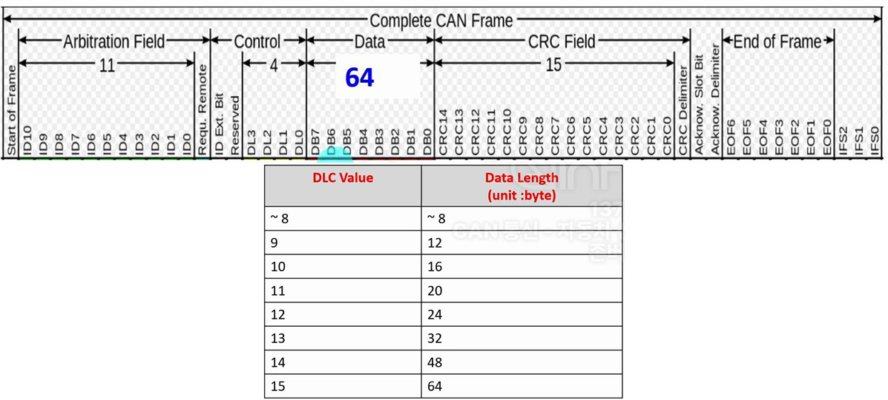
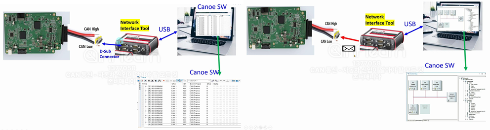
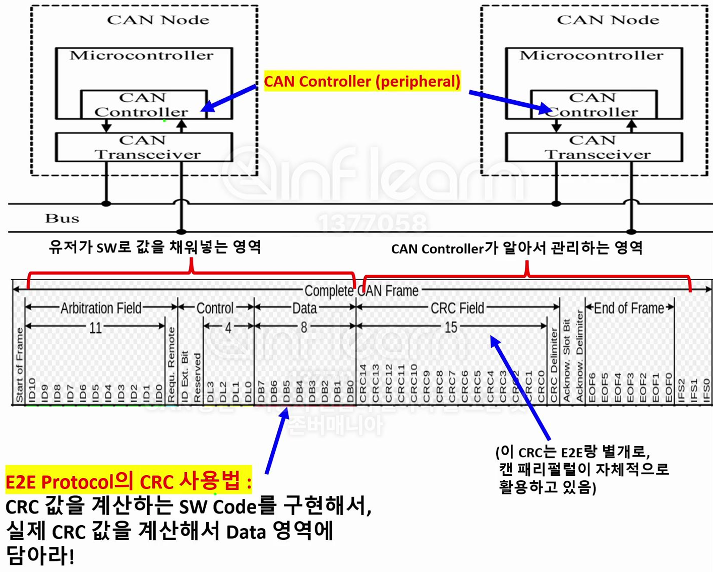
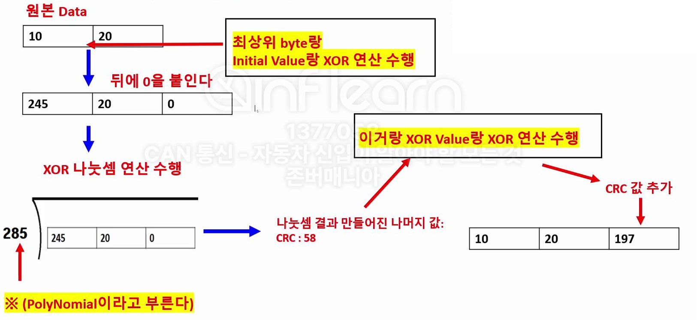
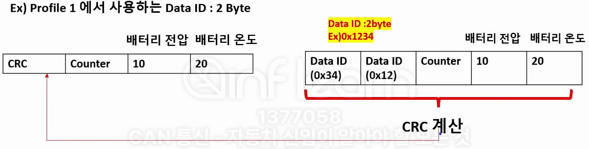

### CAN Error 개요

* 차량 부품의 오작동은 생명과 직결되므로, 차량 통신의 **신뢰성**이 매우 중요  
→ CAN 통신은 **고장 감지** 및 이에 대한 CAN 컨트롤러의 **대응 메커니즘**을 프로토콜에 정의하여 신뢰성 확보
* Error 예시
    - 데이터를 `1`로 보내야 하는데 잘못 `0`으로 보냄
    - 데이터 포맷(ID, DLC, 데이터 등)을 벗어난 메시지를 보냄
    - 보낸 데이터 `1`을 `0`으로 잘못 해석
* 에러 처리 메커니즘
    - 에러의 종류를 감지
    - 에러 발생 시 동작 정의
    - 반복된 에러 발생 시 추가적인 대응책

### CAN Error 처리 메커니즘
* CAN 프로토콜에서는 **3가지 Error State**를 정의하고 있음  
→ CAN 네트워크를 구성하는 각 제어기(CAN Controller)는 Error State를 가지고 있으며, 이에 따라 오류를 감지하고 관리하는 방식이 달라짐
 

    

<strong>CAN Controller Error State</strong>

1. **Error Active**
    - **특징**: 제어기에서 **적극적**으로 에러를 감지하고 네트워크에 전달하는 상태
    - **동작**:
        - 메세지 송, 수신 중 에러 감지 시 `TEC`(Transmit Error Counter) 또는 `REC`(Receive Error Counter)를 증가시키며 **Active Error Frame** 송신
        - **Active Error Frame**은 **6개의 Dominant 비트(우선 순위 높음)** 를 포함하여 **Bit Stuffing Rule**을 의도적으로 어기며, Stuff Error를 발생시킴으로써 다른 제어기에 에러를 **무조건** 알림
2. **Error Passive**
    - **특징**: 에러 발생 횟수가 많아져 통신 참여 우선순위가 낮아진 상태
    - **동작**:
        - 에러 감지 시 동일하게 `TEC` 또는 `REC`를 증가시키고 **Passive Error Frame** 송신
        - **Passive Error Frame**은 **14개의 Recessive 비트(우선 순위 낮음)** 로 구성되어 Stuff Error를 발생시키지만, 네트워크의 다른 메시지에 의해 덮일 수 있어 **Error 알림의 강도가 약함**  
        → 에러 발생 횟수가 많아지면 다른 제어기 통신을 위해 알림의 강도를 약하게 전환하고 일정 시간 후에도 계속 에러 발생 시 Bus off 상태로 전환  
        → Error Passive State에서 메시지 송신 후 일정 시간 대기 시간(8 bit time)을 가짐으로써 Error Active State인 제어기 보다 우선순위가 낮아짐  
3. **Bus Off**
    - **특징**: 통신에서 완전히 배제된 상태
    - **동작**:
        - `TEC`이 255를 초과할 경우 버스 오프 상태로 전환되며 CPU에 Bus Off 상태 알림
        - 메시지 송신 및 수신이 불가능
        - 버스 오프 발생 시 **CAN 컨트롤러를 리셋**하여 통신에 재참여하도록 설정
* **State Transition**
    - **Error Active → Error Passive**: TEC 또는 REC ≥ 128
    - **Error Passive → Bus Off**: TEC ≥ 255
    - **정상적인 통신 시 카운터 감소**

### Bit Stuffing Rule
* **정의**: **버스 상**에 **동일한** 비트가 **6개 이상 연속**으로 출력될 수 없음  
→ CAN 컨트롤러에서 5개의 동일 비트를 연속하여 송신하게 될 경우 6번째 비트에 **강제로 반대 비트**를 삽입하여 버스에 출력  
→ 수신자는 5개의 동일 비트를 연속으로 수신하게 될 경우 6번째 삽입된 비트를 무시하고 데이터를 해석
* **의도적인 Bit Stuffing 위반**: Error 발생 시, CAN Controller는 현재 Error State(Active/Passive)에 따라 **Active Error Frame(6 Dominant + 8 Recessive)** 또는 **Passive Error Frame(14 Recessive)** 비트를 강제로 연속 전송하여 네트워크에 Stuff Error 발생 → 다른 제어기에서 에러 검출 인지
 

    

<strong>Bit Stuffing Rule</strong>

### CAN Error 종류
* CAN 프로토콜에서는 5가지 에러를 정의하고 있으며, CAN Controller가 에러를 감지하면 에러 처리 메커니즘이 동작

1. **Bit Error**
    - **개념**: CAN 컨트롤러는 송신자가 전송한 비트를 Bus에서 다시 읽어 실제 출력값과 비교하여 에러 여부 판단 (ex. 1을 보냈는데 0이 수신되거나, 0을 보냈는데 1이 수신된 경우)  
    - **에러 예외 상황**: 메세지 **ID 영역에서의 Arbitration** 과정 또는 **Ack 영역**에서는 비트 에러가 아닌 정상 동작으로 간주  
    → ex. 우선순위가 낮은 메시지를 보내던 제어기가 우선순위가 높은 메시지를 감지하면 자신이 보낸 메세지 ID 비트값(1)을 다시 읽었을 때 0으로 나타날 수 있지만, 이를 에러로 처리하지 않음

2. **Stuff Error**
    - **개념**: 버스상에서 같은 비트가 6번 연속으로 나타나면 에러로 간주

3. **CRC Error (Cyclic Redundancy Check Error)**
    - **CRC**: 전송 중 **메세지 값 변경 여부**를 검출하기 위한 대표적인 통신 오류 검출 방식으로 CAN을 포함한 다양한 데이터 통신에서 널리 사용됨
    - 송신 제어기는 메시지 데이터를 기반으로 CRC를 계산해 **CRC Field**에 포함하여 전송 (cf. E2E 프로토콜의 CRC - Data Field)
    - 수신 제어기는 수신된 메시지로 CRC를 다시 계산하고, 전송된 CRC 값과 비교하여 데이터 변조 여부를 판단
    - **Checksum**: Checksum은 단순한 덧셈 방식으로 에러 검출 능력이 낮지만, CRC는 나눗셈 기반으로 더 높은 정확도로 데이터 변조를 감지

4. **Acknowledge Error**
    - **Acknowledge**: 메세지 송신시, 송신 제어기는 **Acknowledge Slot Bit(ACK)** 를 **1**로 채워 전송하고, 수신 제어기는 CRC값을 확인하여 데이터가 정상임을 확인한 후 **0 (Dominent)** 으로 다시 출력  
    → 송신 제어기가 1을 썼는데 다시 읽었을 때 0이라면, 이는 메시지가 정상적으로 수신되었음을 의미  
    → 수신 제어기에서 CRC 에러를 검출하면 ACK는 1로 유지되며, 송신 제어기는 Acknowledge Slot Bit 1값을 통해 이를 에러로 간주
    - **에러 예외 상황**: 버스에 **수신자가 없으면**(Acknowlege 슬롯 비트 1로 수신) 송신 제어기는 Acknowledge Error로 검출하여(TEC 증가) Error Passive State로 전환되지만 이후 Bus Off State로는 전환되지 않음 (TEC 유지, 에러로 처리하지 않음)
 

    

<strong>Acknowledge(ACK)</strong>

5. **Form Error**
    - Invalid CAN Message Format

---

### CANFD (Flexible Data-rate)

* **도입 배경**
    - CAN 통신 프로토콜은 크게 Low-Speed CAN, High-Speed CAN, CAN FD로 구분
    - 기존 High-Speed CAN 통신과 같은 네트워크에서 **호환(사용) 가능**하면서 High-Speed CAN의 **낮은 BaudRate**와 **작은 데이터 영역** 의 한계 보완

* **특징**
    - 데이터 영역 크기 및 BaudRate 증가
        - High-Speed CAN: 최대 **8바이트 (1Mbps)**
        - CAN FD: 최대 **64바이트 (8Mbps)**
    - 메세지 전체 영역이 아닌 **데이터 영역**에서만 **빠른 Baudrate**이 적용
        - **Arbitration Baudrate**: 데이터 영역 외 구간에서의 Baudrate
        - **Data Baudrate**: 데이터 영역에서의 Baudrate
    - **샘플링 포인트**도 Baudrate에 따라 별도로 설정 필요
    - 같은 네트워크에서 CAN FD와 High-Speed CAN를 함께 사용 가능하며 이를 위해 High-Speed CAN과 CAN FD를 모두 지원하는 트랜시버가 필요
        - ex. TJA1043 트랜시버
    - 데이터 영역의 Baudrate에 따라 **종단 저항 크기가 달라질 수 있음** (통신속도에 따른 임피던스 따라 저항 크기 결정)
    - DLC(Data Length Code)는 메세지내 데이터 영역의 크기를 나타내는 필드이며 **4bit로 표현**  
    → 4bit DLC만으로는 CAN FD의 실제 데이터 길이(최대 64바이트)를 표현할 수 없으므로 CAN FD에서는 확장된 데이터 길이를 표현할 수 있도록 DLC값을 아래와 같이 재정의하여 사용
    - 이외에도 CAN FD는 CRC 필드 계산 방식 및 길이, Control 필드 구성 등 메시지 포맷이 High-Speed CAN과 일부 다르게 정의
     
    

        
    

    
<strong>CANFD DLC</strong>

* ※ **Low-Speed CAN**
    - 최대 125kbps Baudrate 지원
    - CAN HIGH와 CAN LOW 전선 중 하나가 끊어져도 통신 가능
    - 버스 양 끝단에 120옴 저항을 사용하지 않고, 각 제어기 CAN HIGH, CAN LOW 전선에 개별 저항이 달림
    - 현재 **거의 사용되지 않음**

### CAN DB & CAN DBC
* **CAN DB**(Communication Matrix, K-Matrix): CAN 네트워크와 관련된 필수 정보를 포함한 데이터베이스
* **CAN DBC**: 벡터(Vector)라는 독일 회사에서 만든 **CAN DB를 저장하는 파일 형식(확장자)**
    - 벡터(Vector)사의 **CANdb++ Editor**를 활용하여 CAN DBC 작성 가능
* **포함 주요 정보**
    - **메시지 ID**: 네트워크에서 사용되는 각 메시지의 고유 ID
    - **메시지 이름**: 각 메시지의 식별 이름
    - **데이터 길이**: 메시지 데이터 영역의 길이
    - **송수신 제어기 정보**:
        - 메시지를 송신하는 제어기
        - 메시지를 수신하는 제어기
    - **메시지 전송 방식**:
        - 주기적으로 메시지를 전송하는 방식 (Send Type: Periodic)
        - 메세지 내 특정 시그널값이 변경될 때만 메시지를 전송하는 방식 (Send Type: On Change)
    - **메시지 내 시그널 정보**:
        - 시그널의 위치, 크기, 팩터, 오프셋 정보
        - 데이터 영역에서 시그널의 배치와 크기
    - 그외 **CAN 프로토콜 정의**(High-Speed CAN, CAN FD), **Baudrate**, **Sampling Time** 등을 포함

### CANoe
* CANoe는 Vector사가 개발한 소프트웨어로, CAN 네트워크 분석, 시뮬레이션, 검증 작업에 활용
* PC에는 CAN Controller가 내장되어 있지 않아 CAN 통신이 불가능하며, CANoe와 같은 네트워크 인터페이스 장비를 통해 CAN 네트워크와 PC간 통신을 가능하게 함
* 주요 기능
    - **CAN 메시지 로깅 및 분석**: 네트워크에서 주고받는 메시지를 실시간으로 기록하고 분석 (DBC 파일 임포트)
    - **가상 제어기 시뮬레이션**: 가상의 제어기(네트워크)를 만들어 CAN 메시지를 송신해 제어기 테스트
    - **버스 로드 측정**
    - **에러 프레임 감지**
 

    

<strong>CANoe</strong>

---

### E2E 프로토콜 (End to End Communication Protection)
* 메세지 전송 중 에러가 발생할 경우, 이를 감지하는 메커니즘을 정의 해둔 프로토콜
* E2E 프로토콜은 에러를 감지할 수 있는 메커니즘을 제공하지만, 에러 발생 시 제어기가 어떻게 반응할지에 대한 정의는 포함하지 않음 → 제어기 개발자가 직접 설계 필요
* E2E 프로토콜이 감지할 수 있는 오류 : 
    - 데이터 내용 변경 (Corrupt): 송신 측에서 보내는 데이터가 수신 측에서 변경되어 수신되는 경우
    - 메세지 전달 누락 (Loss): 송신 측에서 보내는 메시지가 수신 측에 도달하지 못하는 경우
    - 메시지 전달 순서 오류 (Incorrect Sequence): 메시지가 송신된 순서대로 도달하지 못하는 경우
    - 동일한 메세지 반복 전송 (Repetition): 동일한 메시지가 반복적으로 송신되는 경우
    - 인증 되지 않은 송신자가 메세지 송신 (Masquerading): 메시지를 원래 송신해야 하는 제어기 외 다른 제어기가 보내는 경우
* E2E 프로토콜의 핵심 요소
    - **CRC(Cyclic Redundancy Check)**: 통신중 메시지의 내용이 변경되지 않았는지 검증
    - **Counter(Message Counter, Sequence Counter, Alive Counter)**: 메시지 순서나 반복을 감지
    - **Data ID** : 인증된 제어기의 메세지 송신 여부 검증
* E2E 프로토콜 적용시 송신 메시지의 **데이터 영역**에 CRC와 Counter 값을 추가하여 메시지를 송신 (cf. CRC 영역이 아님)  
→ 위치는 OEM이 정의하지만 일반적으로 **첫 번째 바이트에 CRC**, **두 번쨰 바이트에 Counter**를 배치
* CAN Controller가 자체적으로 사용하는 CRC와 E2E 프로토콜에서 사용하는 CRC는 다름
    - 메세지 **CRC Field**의 CRC는 CAN Controller에서 자동으로 처리하여 사용자가 별도로 CRC 계산 기능을 구현할 필요가 없는 반면, **E2E 프로토콜**은 소프트웨어적으로 CRC 값을 계산하여 메세지의 **데이터 영역**에 포함시켜야 합
 

    

1. **Counter**
    - E2E 프로토콜에서는 카운터를 사용하여 메시지의 순서, 누락, 반복과 같은 다양한 오류를 감지할 수 있음
    - Counter는 송신측에서 **메시지를 송신할 때마다 1씩 증가**하며 **순차적으로** 보내는 규칙
    - **카운터를 통한 오류 감지**
        - **동일한 메세지 반복 전송**: 만약 수신측에서 동일한 카운터 값이 반복적으로 들어온다면, 송신측에 문제가 생겨 동일한 메시지를 계속해서 반복 송신하고 있다는 것을 감지할 수 있음
        - **메세지 전달 누락**: 송신측에서 1, 2, 3, 4 순서대로 카운터 값을 보냈지만 중간에 2번 메시지가 누락되면, 수신측은 1번 다음에 3번 메시지를 받게 되어, 메시지가 누락되었다는 사실을 알 수 있음
        - **메시지 전달 순서 오류**: 카운터 값이 1, 2, 3, 4 순서대로 들어와야 하는데 1, 3, 2, 4와 같이 순서가 바뀌면, 수신측은 이 순서 오류를 감지할 수 있음

2. **CRC**
    - **데이터 송신 과정에서 값이 변경되는 경우**, 이를 감지할 수 있도록 하는 통신 기법 중 하나  
    - **CRC**와 **체크섬** 모두 데이터 오류를 탐지하는 방식으로, **체크섬**은 단순히 **데이터 값을 합산한 결과를 함께 전송하여 수신 측에서 다시 데이터를 합산하여 검증하는 방식**인 반면, **CRC**는 다항식 나눗셈 기반의 **더 복잡한 연산**을 통해 오류를 보다 정교하게 검출. 이때, 원본 데이터 뿐 아니라 Counter 값도 CRC 계산에 활용
    - **CRC 계산 방법 (전체적인 흐름만)**
        - CRC 계산은 원본 데이터 뒤에 0을 추가한 후, XOR 나눗셈 연산을 수행하여 몫과 나머지를 구하며, 이때 나머지 값이 CRC가 됨
        - **Polynomial(다항식)** 은 CRC 계산 시 XOR 나눗셈에서 나누는 값이며, 어떤 다항식을 사용하느냐에 따라 CRC 계산값이 달라짐
        - CRC 계산에 사용되는 다항식은 **CRC 데이터 크기** 등에 따라여러 종류가 존재(CRC-8, CRC-16..)하며, E2E 프로토콜 프로파일에 따라 사용할 다항식이 정의되어있음  
        - 프로파일에 따라 최종 계산된 CRC의 바이트 순서를 뒤집어서 삽입하는 경우도 있음
        - 동일한 다항식이라도 여러가지 표현하는 방식이 존재
         
        

            
        

        
<strong>CRC 계산방법</strong>

    - **인증 되지 않은 송신자가 메세지를 송신하는 오류**를 감지하기 위해 CRC 계산 과정에서 **Data ID**도 함께 사용
        - Data ID는 메시지에 포함되어 송신되지 않고 CRC 계산에만 사용되며, 이때 원본데이터, Counter, Data ID 모두를 활용
        - Data ID는 OEM이 네트워크 설계 시 미리 정하여 제어기 개발자에게 전달
        - ex. OEM : ID가 0x100인 CAN Message의 Data ID는 0x12, 0x34
        - ex. (아래 그림 참조) 프로파일 1에서는 데이터 ID가 2바이트로 정의되어 있으며, CRC를 계산할 때 이 값을 포함하여 계산  
        → 이때 Data ID는 바이트 순서가 반대로 적용 (데이터 ID가 0x1234이면 CRC 계산 시 0x3412로 처리)
         
        

            
        

        
<strong>Data ID를 활용한 CRC 계산방법</strong>

* **E2E 프로토콜 Profile**
    - E2E 프로토콜에는 여러 가지 **Profile(프로파일)** 이 존재하며, 각 프로파일은 CRC, Counter를 계산하는 고유한 방식을 가지고 있음 (**E2E Protocol Specification 문서** 참조)  
    → ex. 각 프로파일은 Counter 계산시 **카운터 비트 크기**, **초기 카운터 값**, **카운터 값의 순환 방식**을 다르게 정의  
    → ex. 각 프로파일은 CRC 계산시 **Polynomial**, **Initial Value**, **XOR Value**을 다르게 정의
    - CRC와 Counter를 사용하는 **전반적인 동작 메커니즘은 동일**
    - E2E 프로토콜 사용이 필수는 아니며 사용시 네트워크에 참여하는 모든 제어기는 **동일한 프로파일을 사용해야 함**
    - E2E 프로토콜 프로파일에 대한 정보는 OEM에서 CAN DBC에 포함하여 제공