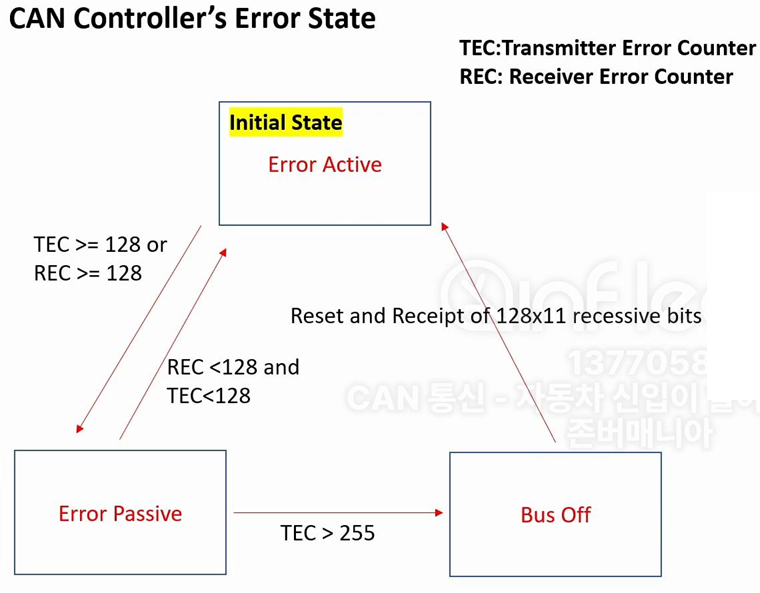
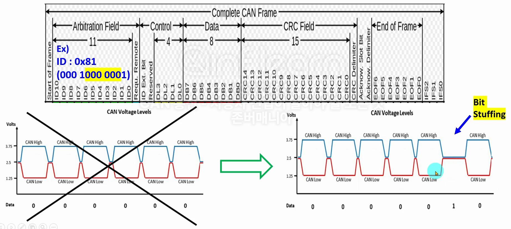
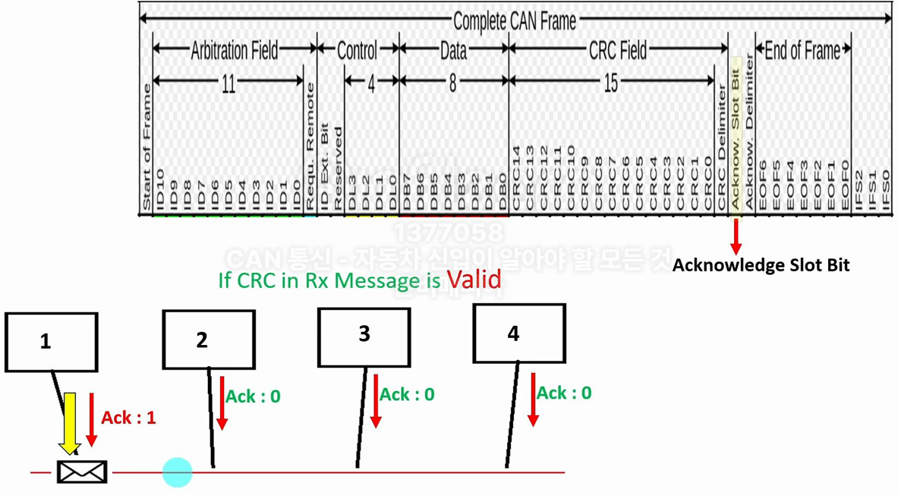

### CAN Error 개요

* 차량 부품의 오작동은 생명과 직결되므로, 차량 통신의 **신뢰성**이 매우 중요  
→ CAN 통신은 **고장 감지** 및 이에 대한 CAN 컨트롤러의 **대응 메커니즘**을 프로토콜에 정의하여 신뢰성 확보
* Error 예시
    - 데이터를 `1`로 보내야 하는데 잘못 `0`으로 보냄
    - 데이터 포맷(ID, DLC, 데이터 등)을 벗어난 메시지를 보냄
    - 보낸 데이터 `1`을 `0`으로 잘못 해석
* 에러 처리 메커니즘
    - 에러의 종류를 감지
    - 에러 발생 시 동작 정의
    - 반복된 에러 발생 시 추가적인 대응책

### CAN Error 처리 메커니즘
* CAN 프로토콜에서는 **3가지 Error State**를 정의하고 있음  
→ CAN 네트워크를 구성하는 각 제어기(CAN Controller)는 Error State를 가지고 있으며, 이에 따라 오류를 감지하고 관리하는 방식이 달라짐
 

    

<strong>CAN Controller Error State</strong>

1. **Error Active**
    - **특징**: 제어기에서 **적극적**으로 에러를 감지하고 네트워크에 전달하는 상태
    - **동작**:
        - 메세지 송, 수신 중 에러 감지 시 `TEC`(Transmit Error Counter) 또는 `REC`(Receive Error Counter)를 증가시키며 **Active Error Frame** 송신
        - **Active Error Frame**은 **6개의 Dominant 비트(우선 순위 높음)** 를 포함하여 **Bit Stuffing Rule**을 의도적으로 어기며, Stuff Error를 발생시킴으로써 다른 제어기에 에러를 **무조건** 알림
2. **Error Passive**
    - **특징**: 에러 발생 횟수가 많아져 통신 참여 우선순위가 낮아진 상태
    - **동작**:
        - 에러 감지 시 동일하게 `TEC` 또는 `REC`를 증가시키고 **Passive Error Frame** 송신
        - **Passive Error Frame**은 **14개의 Recessive 비트(우선 순위 낮음)** 로 구성되어 Stuff Error를 발생시키지만, 네트워크의 다른 메시지에 의해 덮일 수 있어 **Error 알림의 강도가 약함**  
        → 에러 발생 횟수가 많아지면 다른 제어기 통신을 위해 알림의 강도를 약하게 전환하고 일정 시간 후에도 계속 에러 발생 시 Bus off 상태로 전환  
        → Error Passive State에서 메시지 송신 후 일정 시간 대기 시간(8 bit time)을 가짐으로써 Error Active State인 제어기 보다 우선순위가 낮아짐  
3. **Bus Off**
    - **특징**: 통신에서 완전히 배제된 상태
    - **동작**:
        - `TEC`이 255를 초과할 경우 버스 오프 상태로 전환되며 CPU에 Bus Off 상태 알림
        - 메시지 송신 및 수신이 불가능
        - 버스 오프 발생 시 **CAN 컨트롤러를 리셋**하여 통신에 재참여하도록 설정
* **State Transition**
    - **Error Active → Error Passive**: TEC 또는 REC ≥ 128
    - **Error Passive → Bus Off**: TEC ≥ 255
    - **정상적인 통신 시 카운터 감소**

### Bit Stuffing Rule
* **정의**: **버스 상**에 **동일한** 비트가 **6개 이상 연속**으로 출력될 수 없음  
→ CAN 컨트롤러에서 5개의 동일 비트를 연속하여 송신하게 될 경우 6번째 비트에 **강제로 반대 비트**를 삽입하여 버스에 출력  
→ 수신자는 5개의 동일 비트를 연속으로 수신하게 될 경우 6번째 삽입된 비트를 무시하고 데이터를 해석
* **의도적인 Bit Stuffing 위반**: Error 발생 시, CAN Controller는 현재 Error State(Active/Passive)에 따라 **Active Error Frame(6 Dominant + 8 Recessive)** 또는 **Passive Error Frame(14 Recessive)** 비트를 강제로 연속 전송하여 네트워크에 Stuff Error 발생 → 다른 제어기에서 에러 검출 인지
 

    

<strong>Bit Stuffing Rule</strong>

### CAN Error 종류
* CAN 프로토콜에서는 5가지 에러를 정의하고 있으며, CAN Controller가 에러를 감지하면 에러 처리 메커니즘이 동작

1. **Bit Error**
    - **개념**: CAN 컨트롤러는 송신자가 전송한 비트를 Bus에서 다시 읽어 실제 출력값과 비교하여 에러 여부 판단 (ex. 1을 보냈는데 0이 수신되거나, 0을 보냈는데 1이 수신된 경우)  
    - **에러 예외 상황**: 메세지 **ID 영역에서의 Arbitration** 과정 또는 **Ack 영역**에서는 비트 에러가 아닌 정상 동작으로 간주  
    → ex. 우선순위가 낮은 메시지를 보내던 제어기가 우선순위가 높은 메시지를 감지하면 자신이 보낸 메세지 ID 비트값(1)을 다시 읽었을 때 0으로 나타날 수 있지만, 이를 에러로 처리하지 않음

2. **Stuff Error**
    - **개념**: 버스상에서 같은 비트가 6번 연속으로 나타나면 에러로 간주

3. **CRC Error (Cyclic Redundancy Check Error)**
    - **CRC**: 전송 중 **메세지 값 변경 여부**를 검출하기 위한 대표적인 통신 오류 검출 방식으로 CAN을 포함한 다양한 데이터 통신에서 널리 사용됨
    - 송신자는 메시지 데이터를 기반으로 CRC를 계산해 **CRC Field**에 포함하여 전송
    - 수신자는 수신된 메시지로 CRC를 다시 계산하고, 전송된 CRC 값과 비교하여 데이터 변조 여부를 판단
    - **Checksum**: Checksum은 단순한 덧셈 방식으로 에러 검출 능력이 낮지만, CRC는 나눗셈 기반으로 더 높은 정확도로 데이터 변조를 감지

4. **Acknowledge Error**
    - **Acknowledge**: 메세지 송신시, 송신 제어기는 **Acknowledge Slot Bit(ACK)** 를 **1**로 채워 전송하고, 수신 제어기는 CRC값을 확인하여 데이터가 정상임을 확인한 후 **0 (Dominent)** 으로 다시 출력  
    → 송신 제어기가 1을 썼는데 다시 읽었을 때 0이라면, 이는 메시지가 정상적으로 수신되었음을 의미  
    → 수신 제어기에서 CRC 에러를 검출하면 ACK는 1로 유지되며, 송신 제어기는 Acknowledge Slot Bit 1값을 통해 이를 에러로 간주
    - **에러 예외 상황**: 버스에 **수신자가 없으면**(Acknowlege 슬롯 비트 1로 수신) 송신 제어기는 Acknowledge Error로 검출하여(TEC 증가) Error Passive State로 전환되지만 이후 Bus Off State로는 전환되지 않음 (TEC 유지, 에러로 처리하지 않음)
 

    

<strong>Acknowledge(ACK)</strong>

5. **Form Error**
    - Invalid CAN Message Format

---

