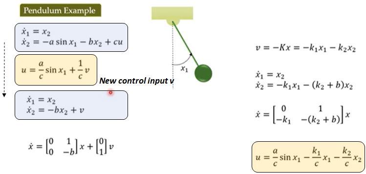

> Reference : https://www.youtube.com/playlist?list=PL9s6YpaXIcJvitrw3aOOeNKycTrr3QBGW 

### Preliminary
* Lie Derviative

### Feedback Linearization
* Powerful technique to design controllers for *nonlinear* systems
* Unlike nonlinear control theory, linear control theory is well developed with systematic approaches  
 → <U>Goal: somehow obtain linear representation of a nonlinear system</U>
    - *Jacobian Linearization* approximates a nonlinear function to a linear function  
    → only valid near equilibrium point (higher order terms are neglected)
    - *Feedback linearization* is an <U>exact linearization</U> of a nonlinear system  
    → Different state space representation using new state variable  
    → No approximations

---

#### Motivation ####
* Pendulum Example
    1. Design control input **u** using newly defined variable **v** such that the nonlinearities are canceled out
    2. Transformation of nonlinear system into *linear system* with new control input **v** (exact representation)
    3. Apply linear control theory (e.g. state feedback control, pole placement technique)
 

    

#### <U>Q. Is it always possible to obtain FB linearization?</U> ####
* If the nonlinear system is represented by the following particular structure → **YES**
 

    

* By taking the following control law, we can utilize any standard contol technique for linear system (e.g. state feedback control law), where A and B must be *controllable*
    - Hurwitz : matrix where all eigen values are in the left half s-plane  
 

    

 

    

#### <U>Q. What if the system is not in that form?</U> ####
→ Define a *State Transformation* to bring the system in the desired form
 

    

#### <U>Q. Does there always exist such a transform?</U> ####
#### <U>Q. If such a transformation exists, then how to find it?</U> ####

#### Full state linearization and input-output linearization? #### 
→ *Stabiliztion problem* : Design control law such that all the **state variables** converge to the equilibrium point  
→ *Tracking problem* : Design control law such that the controlled **output** tracks a reference signal
 

    

1. In full state linearization, *State equations* of the transformed system are linear  
2. By transformation, although we have achieved full state linearization, input-output relation is not *linear*
3. Tracking problem is difficult to solve because input-output has nonlinear relationship. By taking a new control input, we can linearize input-output relationship even though there are nonlinearities in the state equations  
4. In input-ouput linearization, *Output equation* is included  
5. We have to ensure that the state variable is well-behavied, unbounded → stability of internal dynamics (internal : x1 has no influence of the output)  

---

#### Full State Linearization ####
* We want all the state equations to be linearized for *Stabilization problem*  
*cf.* Input-output linearization : Relation between input and output of the system to be linear for  *Tracking problem*  
    1. Consider nonlinear system described by following equations
    2. If **rho (relative degree) = n (dimenstion of state vector)**, we can utilize **state transformation T(x)** to transfrom the nonlinear system in to normal form → obtain full state linearization
    3. It is demonstrated that transformation T(x) is diffemorphism (inverse transformation exsists, and both transfromation and inverse transformations are smooth functions)
 

    

 

* **Proof that transformation T(x) brings the nonlinear system in to *normal form***  
(Typo : n-1 > n-2 /positive sign after u)

    

#### Full state linearization *when rho is less than n* ####
* How to obtain an exact linearization of a nonlinear system if relative degree is less than n ?
* Full state linearization problem is important when solving *stabilization* problem
* In *stabilization* problem, output equation is less important  
→ we only want the state variables to converge to equilbrium point  
→ Define dummy output y or h(x) such that rho=n → perform full state linearization for rho=n
 

    

#### <U>Q. Does there exsist an h(x) ?</U> ####
* To check whether a system is feedback linearizable or not, that is there exists h(x) corresponding to which relative degree is equal to n, you need to check *one of these two conditions* (equilivant conditions)
 

    

    
#### <U>Q. How to find that ?</U> ####
* To find h(x), f***rom definition of relative degree,*** derive guideline to deterimine h(x) and select the simplist form
 

    

    

    

---

### Input-Output Linearization
* ***Full-State Linearization (rho = n)***
    - rho = n → ***Input-Output Linearization is satisfied***
    1. System is both *full state linearized* (all the state equations are linear) as well as *input-output linearized* (relationship between newly defined input v and output variable is linear) 
    2. If relative degree is equal to n, given state transfromation will not only give you full-state linearization but also input-output linearization
     
    

        
    

* ***Input-Output Linearization (rho < n)***
    1. If rho < n, phi always exists at least locally sich that T(x) is a diffemorphism
    2. Dimension of  state transformation T(x) : n-rho, rho for phi, eta respectively. T(x) has total dimension of n 
    3. The given transformation will transform the nonlinear system into normal form including internal dynamics
    4. Reference for matrix Ac, Bc, Cc are listed in Study-Full Feedback Linearization (important!)
     
    

        
    

    1. There are additional state variables which does not appear in input-output relation which are called internal dynamics. State variables of internal dynamics does not affect the output
    2. In addition to solving the trackng problem, we must ensure that the internal dynamics are also stable
    
* **Proof that transformation T(x) brings the nonlinear system in to normal form**
     
    

        
    

    
   
* **Internal Dynamics, Zero Dynamics**

    * If zero dynamics are not stable, we need not perform input-output linearization because that will not be useful (states go unbounded)
        1. Zero dynamics : replace zhi with 0
        2. By confirming the stabilzation of zero dynamics (variable: eta), we can ensure closed loop stability of internal dynamic. (stabilization of zhi is already ensured using designed control input v)
        3. We can vertify the stability of zero dynamics using layapunov theory, or by observation
     
    

        
    

    

        
    
