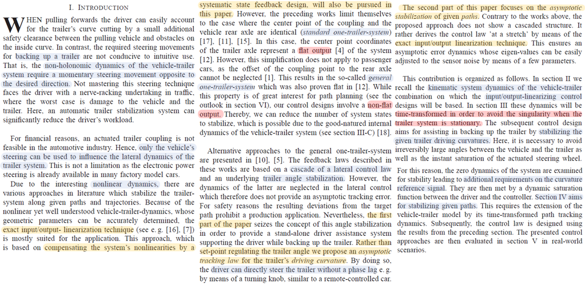
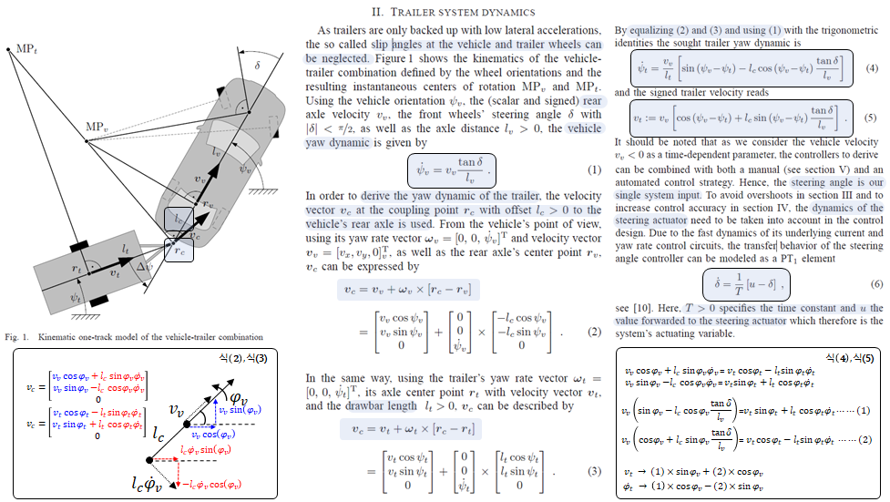
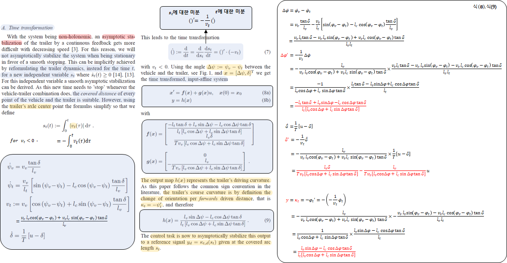

> Reference : Werling, Moritz, et al. "Reversing the general one-trailer system: Asymptotic curvature stabilization and path tracking." IEEE Transactions on intelligent transportation systems 15.2 (2013): 627-636.

### Introduction
전진 주행에서는 트레일러의 거동이 비교적 직관적인 반면 후진 주행에서는 차량–트레일러 시스템의 비홀로노믹 특성으로 인해, 원하는 이동 방향과 반대 방향의 조향 입력이 필요하며 트레일러 거동은 직관적이지 않음. 이로 인해 운전자 부담과 사고 위험이 증가하며, 이를 보조하기 위한 자동화된 트레일러 후진·주차 제어 시스템이 요구된다.
본 포스트에서는 이러한 시스템 설계를 위한 **트레일러 시스템의 기구학(Kinematic) 모델**의 유도를 다룬다.
 
### Assumptions
1. 차량 및 트레일러는 **강체**로 가정  
→ 강체 : 물체 내부의 임의의 두 점 사이의 거리가 항상 일정한 물체, 즉 모든 구성 원자들의 상대적인 위치가 고정  
→ 강체의 모든 점은 동일한 각속도 𝜔를 가지며, 동일한 회전 중심(ICR)을 기준으로 회전
2. 타이어 횡슬립각(Slip Angle) 무시  
→ 각 바퀴의 속도 벡터는 휠의 방향과 일치하며, 이 가정을 통해 차량과 트레일러 각각의 회전 중심을 기하학적으로 정의

### Vehicle Kinematic Model
차량을 강체로 가정하면 회전운동을 할때 모든 지점에서의 raw rate은 동일하며 회전 중심이 동일하다
차량의 Yaw Dynamic은 아래와 같이 주어진다. (글 참조) 조향각이 주어졌을때 차량의 회전 반경은 기하학적 관계에 따라 아래와 같이 정의된다. 이때 회전반경*각속도 = 선속도 이므로 아래와 같이 유도할 수 있다. 차량의 거동에 따른 Trailer의 Kinematic 모델을 유도할 것이다. 이때 Trailer는 차량의 
### Introduction

    

### Trailer System Dynamics

    

### Time Transformations

    

### Vehicle - Trailer Kinematic Model
트레일러가 차량에 연결되어 있는 경우, 차량의 움직임을 기반으로 트레일러의 운동을 기술하고자 한다.  
즉, 모델을 통해 알고자하는 하는것은 차량의 vx와 조향각을 알고 있을때 Trailer의 움직임을 기술하는 것. 즉 트레일러의 차속과 Yaw rate을 차량에 대한 parameter를 활용하여 표현하는 것  
트레일러의 yaw 동역학을 차량의 model과 커플링하기 위해 , 차량의 후축으로부터 거리 l_c > 0 만큼 떨어진 트레일러 연결점(coupling point)을 사용할것이다.

차량을 강체(rigid body)로 가정하면, 차량 후륜 중심에서의 속도 벡터(Translational velocity) 와 Yaw rate(Angular velocity) 를 이용하여, 강체 내 임의의 지점(= coupling point)의 속도를 차량 파라미터에 기반한 관계식으로 계산할 수 있다.  
동일한 방식으로 같은 coupling point의 속도를 트레일러 중심 기준에서 트레일러 기준 parameter로 표현할 수 있으며, 이 두 속도가 같다는 조건을 적용하면 차량의 운동과 트레일러의 운동 사이의 상관관계를 유도할 수 있다.

※  Rigid Motion Translation & Rotation

### Steering Actuator Model
본 논문에서는 스티어링 엑츄에이터의 시간 지연을 반영하기 위해 이를 1차 model로 근사화하여 모델링한다. 

1Track Trailer의 경우 휠에 슬립이 없지만, 2Track Trailer의 경우 슬립을 고려해야할 것 같은데?

Coupler 
트레일러 연결점(coupling point) r_c에서의 속도 벡터 v_c를 사용한다.

트레일러 기준 (vt,)

본 논문에서는 제어기를 구현하기 위해 

### Time Transformation